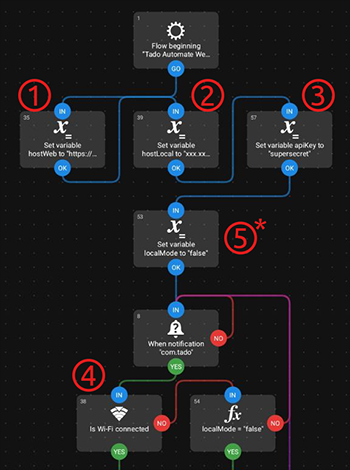
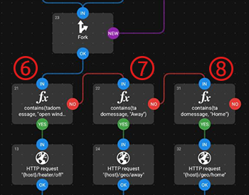

# Tado Automate Web ☕🤖

A minimal REST API for controlling Tado heating devices, designed for integration with automation apps like Automate on Android.  
This project allows you to turn heating on/off based on open window detection and set home/away mode using geofencing. The communication has secure access via API key and HTTPS using Caddy and DuckDNS. 
For easier integration, a docker file is provided. Based on the [PyTado fork](https://github.com/wmalgadey/PyTado).  
All services in this project are free to use.

Author: Martin Zettwitz @mzettwitz  
☕[Buy me a coffee](https://buymeacoffee.com/mzettwitz) I transform it into code🐱‍💻  

---

## 🔀 Workflow  

🏠 Tado detects open window or geofencing  
&nbsp;&nbsp;&nbsp;&nbsp;  ↓  
📲 Push notification to phone by Tado app  
&nbsp;&nbsp;&nbsp;&nbsp;  ↓  
🤖 Automate processes notification  
&nbsp;&nbsp;&nbsp;&nbsp;  ↓  
🌐 HTTP request to DuckDNS  
&nbsp;&nbsp;&nbsp;&nbsp;  ↓  
📡 Router forwards to local host  
&nbsp;&nbsp;&nbsp;&nbsp;  ↓  
🔐 Caddy reverse proxy on Docker  
&nbsp;&nbsp;&nbsp;&nbsp;  ↓  
🐳 Automation web server on Docker  
&nbsp;&nbsp;&nbsp;&nbsp;  ↓  
🔁 Call Tado API (set open window)  
&nbsp;&nbsp;&nbsp;&nbsp;  ↓  
✅ Automate closes notification  

---

## 🚀 Features

* Set open window for a specific zone or automatically detect open windows
* Turn heating on for a specific zone
* Set home mode to home or away based on geofencing
* Secure access using auth header
* HTTPS support via Caddy and DuckDNS
* Rate limiting in Caddy for HTTP requests
* Local setup possible 

---

## 📂 Project Structure

```
tado_automate_web/
 ├── api/
 │    └── main.py             # FastAPI application
 ├── doc/                     # Images for ReadMe
 ├── Dockerfile               # Docker build file for automation
 ├── Dockerfile.caddy         # Docker build file for caddy reverse proxy
 ├── docker-compose.yml       # Docker Compose configuration
 ├── Caddyfile                # Caddy reverse proxy configuration
 ├── requirements.txt         # Python dependencies for automation
 ├── ReadMe.md                # Useful information for commissioning
 └── Tado Automate Web.flow   # Automate flo file to read the Tado message on your phone.
```

---

## 🧰 Prerequisites

* Docker and Docker Compose installed on your system
* A DuckDNS domain (e.g., `yourdomain.duckdns.org`)
* Tado credentials
* Portforwarding in your router
* Ports in your docker host are available and not blocked by another application (e.g. pihole)
* [Automate](https://llamalab.com/automate/) installed on your Android phone
* Open window detection and geofencing activated in Tado


> Note, you do not need to use duckdns and expose your container at all. You can also use it in your local network only. 
Have a look at the section [Local Setup](#local-setup) for details.

---

## 🛠 Installation
### Web Setup

1. Clone the repository:

```bash
git clone https://github.com/mzettwitz/tado_automate_web.git
cd tado_automate_web
```

2. Set your environment variables in `docker-compose.yml`:

```yaml
environment:
  - API_KEY=yoursupersecretkey
  - TZ=Europe/Berlin

  - DUCKDNS_TOKEN=your_duckdns_token
```

3. Set your duckdns domain in `Caddyfile`: 

```
yourdomain.duckdns.org {
```

> Note, you may want to adjust the rate limit for your needs. See [Caddy-Ratelimit](https://github.com/mholt/caddy-ratelimit)

4. Start and build the containers:

```bash
docker compose up -d --build
```

> Note, on first startup, you need to register Tado. The login URL is shown in the container logs. 
Therefore, it is best to start the containers attached without `-d` flag to have the logs in the console.

5. Ensure your router forwards ports (80 optional and) 443 to your host running Docker. You may want to forward a diffent external port to your Caddy local port. 
E.g. external 8765(web) to 443(docker host).


### Local Setup

Instead of exposing your server to the web, you can use the setup in your local network only. Hence, it will only work, when your phone is in the same network as the docker host. 
A VPN might be a solution for you if you want the same functionality when you are outside, but want to keep the server local.  
For the local setup, you just need to make minor changes:  
- docker-compose.yml: remove (or comment) all caddy parts: 
```yaml
# caddy:
#   build:
#     context: .
  ...

volumes:
#  caddy_data:
#  caddy_config:
```

- Port forwarding in your router is not necessary when serving local only
- Activate the localMode in the Automate script (5)

---

## 🤖 Automate Integration

This section explains how to trigger the Tado API from the [Automate](https://llamalab.com/automate/) app on Android. Make sure you alter the nodes for your setup and language.
Import the file `Tado Automate Web.flo` into Automate on your Android device and start the flow script. Make sure, you allow it to run in background (and energy safe mode).

> The script requires location rights on your phone to check if you are connected with the home wifi. No location information are used, though they are in the same access rights category in Android.

### Mandatory modifications you need to make
You have to change the Automate script in two sections:  
**a)  Network setup:**  
1. Set the address of your remote host (DuckDNS domain with external port)  
2. Set the address of your local host (IP of your docker host with the local port)  
3. Set the API key that you used in your docker-compose file in [Web Setup](#web-setup)  
4. Set the wifi network you want to use when you are at home  
5. (Optional) set the localMode to "true" in case you only want to host your server locally  

> Note, if you want to use a local setup with VPN on your phone, you may set the local address (2) for the web host (1), too, and disable (5).



**b) Language setup:**  

6. FX Expression check: make sure the string "open window" matches the language (and message!) of your tado app  
7. FX Expression check: make sure the string "Away" matches the language (and message!) of your tado app for going away  
8. FX Expression check: make sure the string "Home" matches the language (and message!) of your tado app for coming home  



### General Flow

1. **Trigger**

   * Event: `Notification received`
   * App: Tado
   * Store text in variable

2. **Expression Check: Network mode**

   * Expression: check if the request should be send locally or via web

3. **Expression Check: Open windows**

   * Expression: Tado notification variable contains "open window"
   * We do only check for this small part of the message since multiple windows can be open, and thus, the message changes
   * If the windows are not open, check for geofencing

4. **Action: HTTP Request**

   * Type: `HTTP Request` → `PUT`
   * URL: `https://yourdomain.duckdns.org/heater/off`
   * Headers:
     ```text
     X-API-KEY: supersecret
     ```
   * Timeout: 30 seconds
   * Follow redirects: No
   * Store response code and content in variable

5. **Expression Check: Response Handling**

   * HTTP response code is used to check if the request was successful:
   * If true: remove the Tado notification
   * If false: show a notification with the HTTP response content
   * Log the result

---

## 🔷 API Endpoints

### Turn heater off

```http
PUT https://yourdomain.duckdns.org:8765/heater/off
Headers: X-API-KEY: supersecret
```
```
Optional query parameter: ?zone=LivingRoom
```

### Turn heater on

```http
PUT https://yourdomain.duckdns.org:8765/heater/on?zone=LivingRoom
Headers: X-API-KEY: supersecret
```

### List zones

```http
GET https://yourdomain.duckdns.org:8765/zones
Headers: X-API-KEY: supersecret
```

### Geofencing away

```http
PUT https://yourdomain.duckdns.org:8765/geo/away
Headers: X-API-KEY: supersecret
```

### Geofencing home

```http
PUT https://yourdomain.duckdns.org:8765/geo/home
Headers: X-API-KEY: supersecret
```

### Health check

```http
GET https://yourdomain.duckdns.org:8765/health
```

---

### Zone Detection

If no zone is provided in `/heater/off`, the API automatically detects the zone with `openWindowDetected`. 
Note, this will use additional Tado API calls. If you are a free user, this might interfere with your 100 API calls per day in case you have many(!) zones and call this function often. Usually, this should be no problem.

---

### Logging

All actions are logged in `/logs/l.log` inside the container if enabled in the docker-compose file.

---

## 💭 Final Notes

* Always use HTTPS (`https://`) since Caddy provides a valid certificate without effort.
* Ensure the `X-API-KEY` header is included for authentication; otherwise requests will be rejected (HTTP 403).
* Rate limiting may block too many requests for protection. Adjust this if the limit is to strict for your needs.

---

## ⚠ Disclaimer

This project is an independent, open-source tool and is **not affiliated with, endorsed by, or supported by Tado° or any of its partners**.  
Use this software at your own risk.
The authors are not responsible for any damage, data loss, or violations of third-party terms of service that may result from using this software.  
Please review Tado°’s terms of use before integrating this project into your setup.

---

## 🤝 Contributing

Feel free to open issues or submit pull requests for improvements, you are welcome to implement other dyndns services or automation tools for iOS.  
Please make sure to test carefully with a clean setup before making a PR.

---

## 👨‍⚖️ License

This project is released under the GPLv3 License. See [LICENSE](LICENSE) for details.
